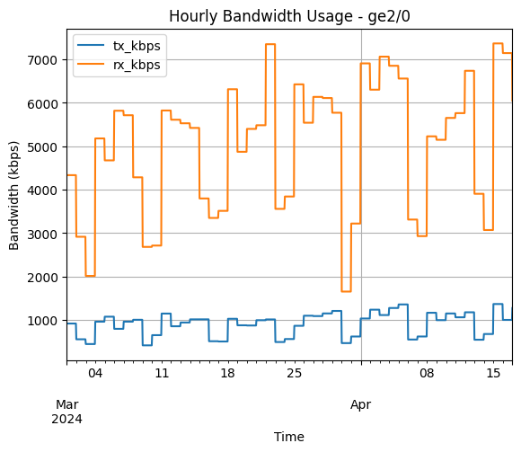
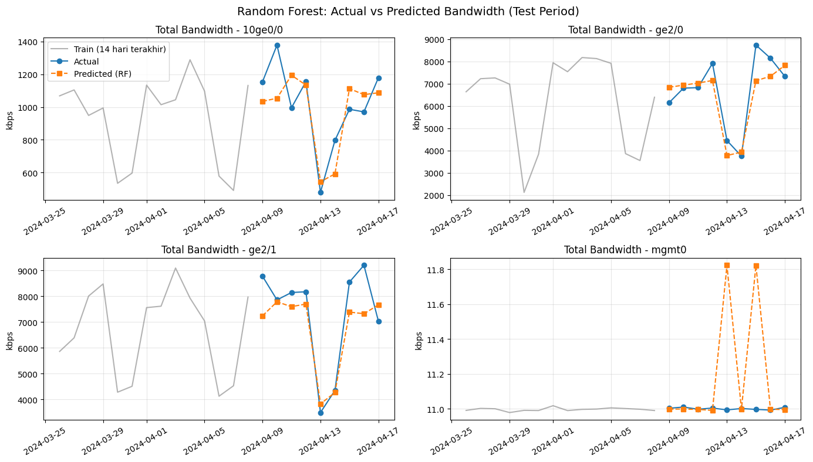
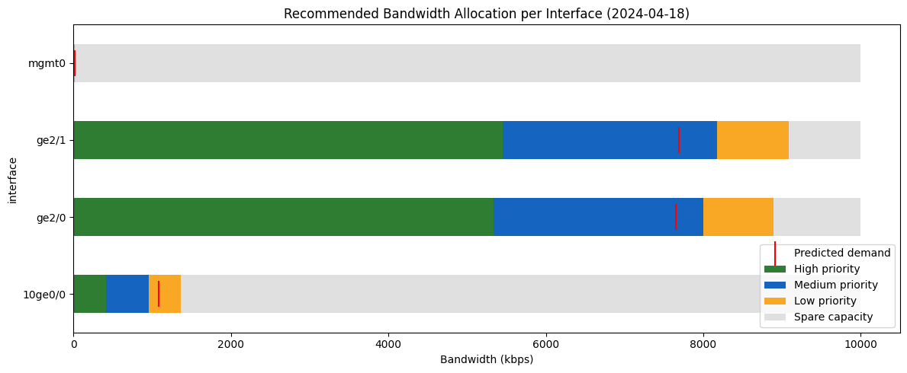
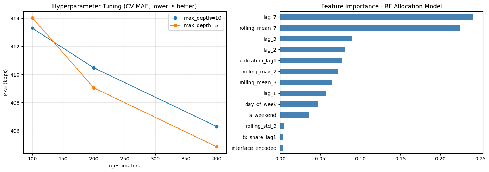
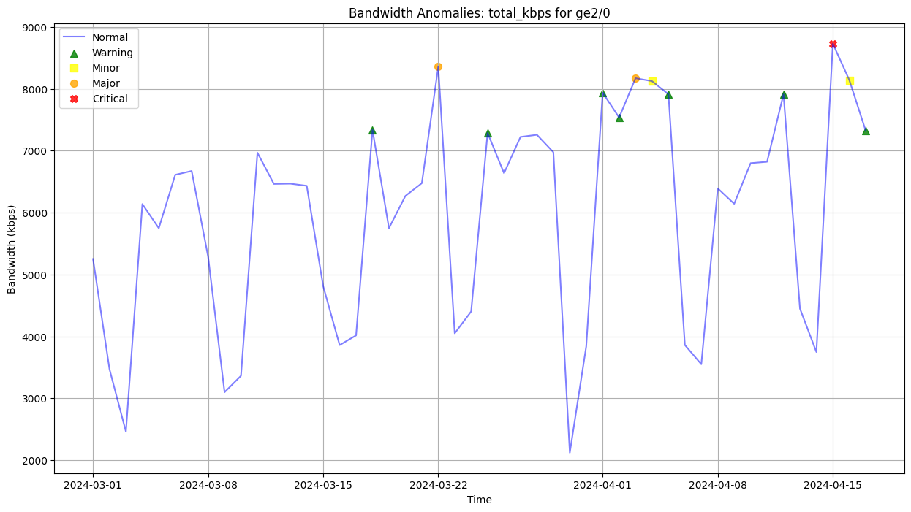
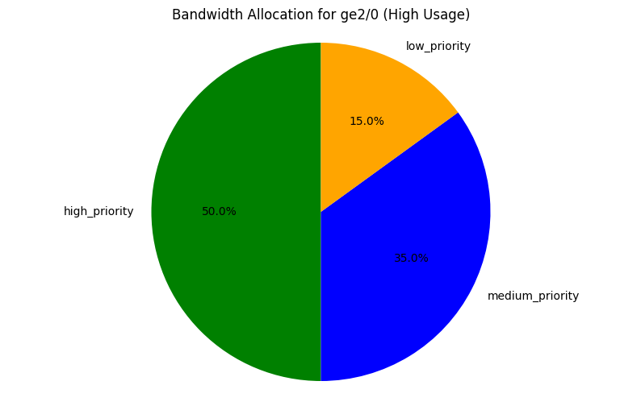

# SD-WAN Bandwidth Analysis & Optimization

A machine learning pipeline for Cisco SD-WAN hubs, built on interface statistics exported from Cisco vManage. The core is a hyperparameter-tuned **Random Forest** model that predicts each interface's bandwidth demand for the next period and turns that forecast into a **recommended bandwidth allocation** split by priority class. The pipeline also covers TX/RX prediction, SARIMAX forecasting, and threshold-based anomaly detection.

The original work covered **8 hubs with 5+ spokes each**. This repo shows the full pipeline on **one hub** as a representative example.

> ⚠️ **About the data:** The real network data is confidential and is not included. The notebook runs on a **synthetic dataset** with the same schema (`data/sample_hub_data.json`), so every number and chart in this repo comes from dummy data, not from a real network.



## Pipeline

| Step | What it does |
|---|---|
| 1. Load & assess | Parses the vManage JSON export and extracts time features (day of week, weekend flag, month) |
| 2. Cleaning | Removes duplicates, keeps relevant interfaces, and removes outliers with IQR |
| 3. Feature engineering | Adds `total_kbps`, `usage_percentage` (vs. interface capacity), `time_since_last_entry`, and `bandwidth_change` |
| 4. Regression models | Compares Random Forest, XGBoost, and LightGBM for predicting TX and RX bandwidth from historical lag and rolling features, using a chronological split and `TimeSeriesSplit` CV |
| 5. Feature importance | Compares which features drive TX vs. RX usage |
| 6. Time series | Runs seasonal decomposition, then SARIMAX forecasting per interface for both TX and RX |
| 7. Anomaly detection | Sets percentile-based thresholds and labels each point as **Warning / Minor / Major / Critical** |
| 8. Rule-based optimization | Assigns a High / Medium / Low priority split based on each interface's current usage level |
| 9. **RF allocation model** | Uses a tuned Random Forest to forecast next-period demand, then outputs a recommended allocation per interface ([details](#random-forest-bandwidth-allocation)) |

## Random Forest Bandwidth Allocation

This is the main model. It recommends how much bandwidth each interface should get **for the next period**, based on predicted demand rather than current usage alone.

- **Target:** total bandwidth (TX + RX) in the next period
- **Features:** historical data only (lags of 1/2/3/7 periods, rolling mean/std/max, previous TX share and utilization, day of week, interface), so there is no data leakage
- **Hyperparameter tuning:** `GridSearchCV` with `TimeSeriesSplit` over `n_estimators`, `max_depth`, `min_samples_leaf`, and `max_features` (54 combinations)
- **Recommendation logic:** `recommended = predicted demand + 1.645 × σ_error` (a 95% buffer), capped at interface capacity. The resulting utilization sets the usage level, which determines the High / Medium / Low priority split.





**Results on the synthetic test period** (for illustration only, not real network performance):

| Model | MAE (kbps) | RMSE (kbps) | R² | WAPE |
|---|---|---|---|---|
| Random Forest (tuned) | 376.7 | 615.3 | 0.969 | 10.1% |
| Baseline: previous value | 816.1 | 1562.8 | 0.799 | 21.8% |
| Baseline: 7-day mean | 816.9 | 1267.9 | 0.868 | 21.8% |



## Other Outputs

<p>
  
  
</p>

## Project Structure

```
sdwan-bandwidth-optimization/
├── notebooks/
│   └── sdwan_bandwidth_analysis.ipynb   # full pipeline, section by section
├── data/
│   ├── generate_synthetic_data.py       # creates the dummy dataset
│   └── sample_hub_data.json             # synthetic data (same schema as vManage export)
├── images/
├── requirements.txt
└── README.md
```

Each section of the notebook adds new methods to the `BandwidthAnalyzer` class. The full pipeline runs in the second-to-last cell, and the final section contains the Random Forest allocation model.

## How to Run

```bash
git clone https://github.com/syahiiralhaddad/sdwan-bandwidth-optimization.git
cd sdwan-bandwidth-optimization
pip install -r requirements.txt
jupyter notebook notebooks/sdwan_bandwidth_analysis.ipynb
```

To regenerate the dummy data, run `python data/generate_synthetic_data.py`.

**Input format** (one record per interface per time bucket):

```json
{"data": [{"entry_time": 1709251200000, "count": 281, "interface": "ge2/0", "tx_kbps": 912.4, "rx_kbps": 4980.1}]}
```

## Tech Stack

Python · pandas · scikit-learn · XGBoost · LightGBM · statsmodels (SARIMAX) · Matplotlib · seaborn
